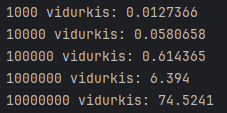
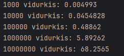
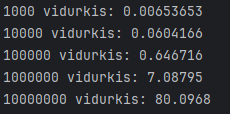

# OOPUzduotis1 - v1.0

## Programos testavimo kompiuterio specifikacijos
| Komponentas | Specifikacija           |
|-------------|-------------------------|
| CPU         | Intel i7-13700H 2.40GHz |
| RAM         | 16 GB DDR5              |
| HDD         | SSD                     |

# Strategiju testavimo rezultatai

## Strategija 1
# Su Vector

# Su List

# Su Deque

 

-------------------------
# Programos testavimo rezultatai pradiniam release:
Testuojama tik failo nuskaitymas, įrašų rūšiavimas bei kategorizavimas. Pateikiamas trijų testų vidurkis.  
Visi failai turi po 5 ND pažymius.
## Testavimas su vector:

## Testavimas su list:

## Testavimas su deque:
 