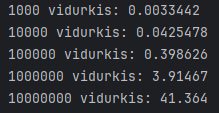
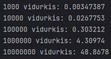
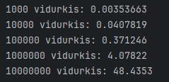

# OOPUzduotis1

### Failų generavimo testavimo nuotraukos:
  

## Darbo su failais analize

### 1000 Studentu analize
7 namų darbų pažymiai 
1000 vidurkis: 0.011142

### 10000 Studentu analize
5 namų darbų pažymiai  
10000 vidurkis: 0.0718831

### 100000 Studentu analize
9 namų darbų pažymiai  
100000 vidurkis: 0.700177

### 1000000 Studentu analize
9 namų darbų pažymiai 
1000000 vidurkis: 6.07697

### 1000000 Studentu analize
12 namų darbų pažymių 
10000000 vidurkis: 86.0694

